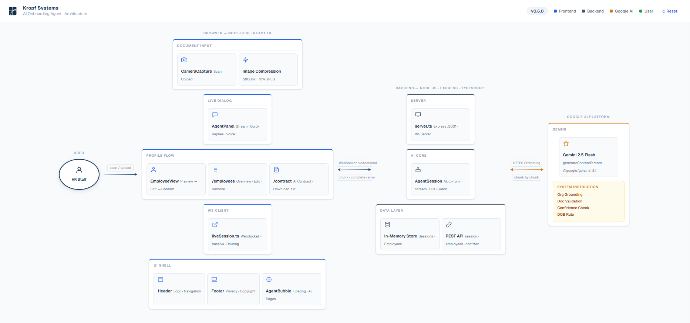

# AI Onboarding Agent

> Turning real-world documents into structured system data through live, streaming AI dialogue.

Built for the **Gemini Live Agent Challenge** · Category: **Live Agents**

---

> ## 📦 Archived — April 2026
>
> This project was submitted to the **Gemini Live Agent Challenge** (submission: March 16, 2026). After the judging period ended, the hosted cloud resources were decommissioned to stop ongoing costs. The **source code in this repository is intact and unchanged** — the project can be redeployed at any time via `gcloud run deploy --source .` (see [Google Cloud Deployment](#google-cloud-deployment)).
>
> The [demo video](#demo-video) remains available and shows the full system in action.

---

## Demo

Live demo has been decommissioned post-judging. See the [Demo Video](#demo-video) for a walk-through of the full system, or follow the [Local Setup](#local-setup) instructions to run it yourself.

---

## What It Does

The AI Onboarding Agent converts real-world documents directly into structured system records through a natural, live conversation.

Instead of filling out forms, users take a photo of a document. The agent:

1. Analyzes the document using Gemini's multimodal vision capabilities
2. Streams results in real time — no loading spinner, no waiting
3. Asks short follow-up questions for any missing fields
4. Shows a profile preview — confirm, edit inline, or discard
5. Saves a clean, structured employee record
6. Optionally generates a full employment contract (AI-written, downloadable)

The **AI Agent panel** (bottom-right) is available on every page at all times. Outside of an active onboarding, it acts as a general assistant: ask questions about employees, navigate the app, or start a new onboarding — all through natural conversation.

**Demo use case:** Employee onboarding via ID card photo.

---

## Architecture



**Onboarding data flow:**

```
HR Staff
  → [scan / upload] → CameraCapture → Image Compression (≤800px, 70% JPEG)
  → [base64 image]  → liveSession.ts (WebSocket client)
  → [WebSocket]     → Express Server (port 3001) → /ws/agent
  → [stream]        → AgentSession → Gemini 2.5 Flash (HTTPS streaming)
  ← [chunks]        ← AgentSession ← Gemini
  ← [events]        ← WebSocket    ← Server
  → [confirm]       → REST API     → In-Memory Store → /employees
```

**Idle chat data flow:**

```
HR Staff
  → [message / voice] → AgentPanel → WebSocket → /ws/chat
  → [stream]          → ChatSession → Gemini 2.5 Flash
  ← [chunks / action] ← ChatSession ← Gemini
  ← [navigate / reply]← AgentPanel
```

---

## Tech Stack

| Layer | Technology |
|-------|-----------|
| Frontend | Next.js 16 (TypeScript), React 19, Tailwind CSS 4 |
| AI | Gemini 2.5 Flash, `generateContentStream` |
| Backend | Node.js / Express (TypeScript), WebSocket (`ws`) |
| Database | In-Memory Store (demo) |
| Hosting | Google Cloud Run |
| SDK | `@google/genai` v1.44 |

---

## Google Cloud Deployment

The project was originally deployed on **Google Cloud Run** (region: `us-central1`). The deployed services have been decommissioned — the commands below re-create them from the source.

**Deploy from scratch:**

```bash
# Backend (first pass — get the backend URL)
cd backend
gcloud run deploy glac-backend \
  --source . --region us-central1 --platform managed --allow-unauthenticated \
  --set-env-vars "GEMINI_API_KEY=your_key,FRONTEND_URL=https://placeholder" \
  --port 3001

# Frontend
cd ../frontend
gcloud run deploy glac-frontend \
  --source . --region us-central1 --platform managed --allow-unauthenticated \
  --port 3000

# Backend (second pass — update FRONTEND_URL with the real frontend URL for CORS)
cd ../backend
gcloud run services update glac-backend --region us-central1 \
  --set-env-vars "GEMINI_API_KEY=your_key,FRONTEND_URL=<actual-frontend-url>"
```

Both services use multi-stage `Dockerfile`s (`node:20-alpine`). The frontend uses Next.js `standalone` output for a minimal production image.

---

## Local Setup

### Prerequisites

- Node.js 20+
- Gemini API key ([get one here](https://aistudio.google.com))

### 1. Clone the repository

```bash
git clone https://github.com/LeeWu-Agents/ai-onboarding-agent.git
cd ai-onboarding-agent
```

### 2. Configure environment variables

**Backend (`backend/.env`):**
```bash
GEMINI_API_KEY=your_gemini_api_key
PORT=3001
FRONTEND_URL=http://localhost:3000
```

**Frontend (`frontend/.env.local`):**
```bash
NEXT_PUBLIC_API_URL=http://localhost:3001
```

### 3. Start the backend

```bash
cd backend
npm install
npm run dev
```

Backend runs on `http://localhost:3001`
WebSocket endpoints: `ws://localhost:3001/ws/agent` (onboarding) · `ws://localhost:3001/ws/chat` (idle chat)

### 4. Start the frontend

```bash
cd frontend
npm install
npm run dev
```

Frontend runs on `http://localhost:3000`

### 5. Open the app

Open [http://localhost:3000](http://localhost:3000) in your browser.

---

## Usage

1. Click **Scan Document** and select or photograph an ID card
2. The agent streams results and asks follow-up questions for missing fields
3. Answer via text, quick-reply buttons, or voice (Chrome/Edge)
4. Review the profile preview — confirm, edit inline, or discard
5. Done — employee profile saved
6. Optional: let the agent generate a full employment contract → download as `.txt`
7. Browse all employees at `/employees` — edit, delete, CSV import/export
8. Use the **AI Agent panel** at any time to ask questions or navigate the app

---

## Repository Structure

```
ai-onboarding-agent/
├── README.md
├── CHANGELOG.md
├── architecture-diagram.png             ← Architecture diagram
├── frontend/
│   ├── Dockerfile                       ← Multi-stage, Next.js standalone
│   ├── app/
│   │   ├── layout.tsx                   ← Root layout: Header + AgentWrapper + Footer
│   │   ├── page.tsx                     ← Main onboarding flow
│   │   ├── employees/page.tsx           ← Employees list (CSV import/export, edit, delete)
│   │   └── contract/page.tsx            ← AI contract generation + download
│   ├── components/
│   │   ├── Header.tsx                   ← Navigation bar (logo + links)
│   │   ├── Footer.tsx                   ← Privacy notice + copyright
│   │   ├── AgentWrapper.tsx             ← Client wrapper: AgentProvider + AgentPanel in layout
│   │   ├── AgentPanel.tsx               ← Always-on agent UI: chat, voice, quick-reply, navigation
│   │   ├── CameraCapture.tsx            ← Document upload + client-side compression
│   │   └── EmployeeView.tsx             ← Profile preview, inline edit, confirm
│   └── lib/
│       ├── agentContext.tsx             ← React context: agent mode, onboarding lifecycle
│       ├── liveSession.ts               ← WebSocket client (OnboardingSession)
│       └── api.ts                       ← Backend REST calls
├── backend/
│   ├── Dockerfile                       ← Multi-stage, node:20-alpine
│   └── src/
│       ├── server.ts                    ← Express + dual WebSocket server (noServer routing)
│       ├── services/
│       │   ├── agentSession.ts          ← Onboarding agent: Gemini streaming, data extraction
│       │   ├── chatSession.ts           ← Idle chat agent: employee queries, navigation signals
│       │   └── store.ts                 ← In-memory store
│       └── routes/
│           ├── sessions.ts
│           ├── employees.ts             ← GET / POST / PUT / DELETE
│           └── contract.ts              ← POST /api/contract
└── smoke-test/                          ← Smoke tests (text, multi-turn, vision)
```

---

## Privacy

The demo uses synthetic sample documents.
In real deployments, personal data must be handled in accordance with applicable data protection regulations (GDPR, etc.).

---

## Demo Video

[Demo Video on YouTube](https://www.youtube.com/watch?v=XJjfxDNQwdg)

---

## License

MIT
