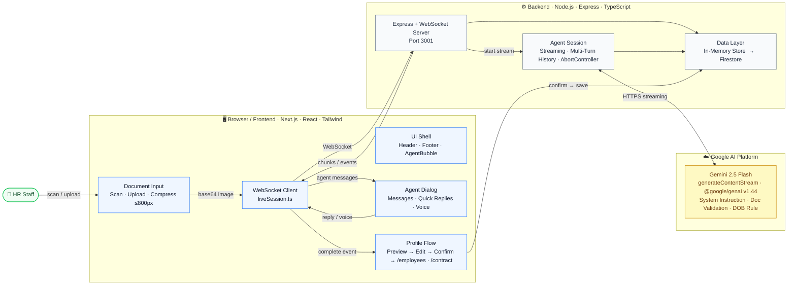

# AI Onboarding Agent

> Turning real-world documents into structured system data through live, streaming AI dialogue.

Built for the **Gemini Live Agent Challenge** · Category: **Live Agents**

---

## What It Does

The AI Onboarding Agent converts real-world documents directly into structured system records through a natural, live conversation.

Instead of filling out forms, users take a photo of a document. The agent:

1. Analyzes the document using Gemini's multimodal vision capabilities
2. Streams results in real time — no loading spinner, no waiting
3. Asks short follow-up questions for any missing fields
4. Shows a profile preview — confirm, edit inline, or discard
5. Saves a clean, structured employee record
6. Optionally generates a full employment contract (AI-written, downloadable)

The persistent floating **AI Agent bubble** (bottom-right) is available on every page for quick access. Employees can be browsed, edited, deleted, and bulk-imported via CSV on the `/employees` page.

**Demo use case:** Employee onboarding via ID card photo.

---

## Architecture



---

## Tech Stack

| Layer | Technology |
|-------|-----------|
| Frontend | Next.js (TypeScript), React 19, Tailwind CSS 4 |
| AI | Gemini 2.5 Flash, `generateContentStream` |
| Backend | Node.js / Express (TypeScript), WebSocket (`ws`) |
| Database | Google Firestore |
| Hosting | Google Cloud Run |
| SDK | `@google/genai` v1.44 |

---

## Setup

### Prerequisites

- Node.js 20+
- Gemini API key ([get one here](https://aistudio.google.com))

### 1. Clone the repository

```bash
git clone https://github.com/LeeWu-Agents/ai-onboarding-agent.git
cd ai-onboarding-agent
```

### 2. Configure environment variables

**Backend (`backend/.env`):**
```bash
GEMINI_API_KEY=your_gemini_api_key
PORT=3001
FRONTEND_URL=http://localhost:3000
```

**Frontend (`frontend/.env.local`):**
```bash
NEXT_PUBLIC_API_URL=http://localhost:3001
```

### 3. Start the backend

```bash
cd backend
npm install
npm run dev
```

Backend runs on `http://localhost:3001`
WebSocket on `ws://localhost:3001/ws/agent`

### 4. Start the frontend

```bash
cd frontend
npm install
npm run dev
```

Frontend runs on `http://localhost:3000`

### 5. Open the app

Open [http://localhost:3000](http://localhost:3000) in your browser and allow camera access when prompted.

---

## Usage

1. Click **Scan Document** or **Upload**
2. Take a photo of an ID card
3. The agent detects the person and asks follow-up questions
4. Answer via text, quick-reply buttons, or voice (Chrome/Edge)
5. Review the profile preview — confirm, edit inline, or discard
6. Done — employee profile saved
7. Optional: let the agent generate a full employment contract → download as `.txt`
8. Browse all employees at `/employees` — edit, delete, CSV import/export

---

## Repository Structure

```
ai-onboarding-agent/
├── README.md
├── CHANGELOG.md
├── architecture-diagram.html     ← Interactive architecture (open in browser)
├── frontend/
│   ├── app/
│   │   ├── layout.tsx            ← Root layout: Header + Footer shell
│   │   ├── page.tsx              ← Main onboarding flow
│   │   ├── employees/page.tsx    ← Employees list (CSV import/export, edit, delete)
│   │   └── contract/page.tsx     ← AI contract generation + download
│   ├── components/
│   │   ├── Header.tsx            ← Navigation bar (logo + links)
│   │   ├── Footer.tsx            ← Privacy notice + copyright
│   │   ├── AgentBubble.tsx       ← Persistent floating agent button
│   │   ├── AgentPanel.tsx        ← Agent dialog, voice, quick-reply
│   │   ├── CameraCapture.tsx     ← Camera / Upload + compression
│   │   └── EmployeeView.tsx      ← Profile preview, inline edit, confirm
│   └── lib/
│       ├── liveSession.ts        ← WebSocket client (OnboardingSession)
│       └── api.ts                ← Backend REST calls
├── backend/
│   └── src/
│       ├── server.ts             ← Express + WebSocket server
│       ├── services/
│       │   ├── agentSession.ts   ← Gemini dialog + streaming (core)
│       │   └── store.ts          ← In-memory store (→ Firestore)
│       └── routes/
│           ├── sessions.ts
│           ├── employees.ts      ← GET / POST / PUT / DELETE
│           └── contract.ts       ← POST /api/contract
└── smoke-test/                   ← Smoke tests (text, multi-turn, vision)
```

---

## Privacy

The demo uses synthetic sample documents.
In real deployments, personal data must be handled in accordance with applicable data protection regulations (GDPR, etc.).

---

## Demo Video

[Link to demo video]

---

## License

MIT
